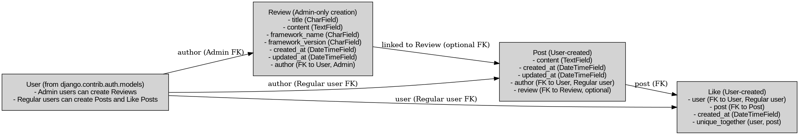

# REVIXA Backend

This repository contains the API developed using Django REST Framework for the REVIXA application, an interactive system for reviews and social interactions.

## Table of Contents
  - [User Stories](#user-stories)
  - [Database](#database)
  - [Technologies Used](#technologies-used)
  - [Validation](#validation)
  - [Testing](#testing)
  - [Credits](#credits)

## User Stories

This project was designed with a focus on user interaction with reviewed content and social interactions, including:
- As a user, I want to be able to register, authenticate, and manage my profile to interact with the platform.
- As an administrator, I want to manage reviews, posts, and interactions to maintain content integrity.

## Database

The database model includes:
- **User:** Stores user information.
- **Review:** Stores reviews made by Admins.
- **Post:** Related to reviews for discussions and social interactions.(create postis limited to users only)
- **Like:** Allows users only to like posts.

Note: No user (visitors) can have access to the content of reviews, posts and likes through the backend, but do not have access to Create posts, also do not have access to give likes.

#### User Model

- The User model contains information about users and is managed through the `django.contrib.auth` library for authentication and user management.
- Admin users can create `Review` entries.
- Regular users can create `Post` entries and `Like` other users' `Post` entries.
- One-to-many relation with the `Review` model through the `author` field (admin users).
- One-to-many relation with the `Post` model through the `author` field (regular users).
- One-to-many relation with the `Like` model through the `user` field (regular users).

#### Review Model

- The `Review` model contains the following fields: `title`, `content`, `framework_name`, `framework_version`, `created_at`, `updated_at`, and `author`.
- ForeignKey relation with the `User` model through the `author` field, which only allows admin users to create reviews.

#### Post Model

- The `Post` model represents user-created posts associated with specific `Review` entries. It contains the following fields: `content`, `created_at`, `updated_at`, `author`, and `review`.
- ForeignKey relation with the `User` model through the `author` field, allowing regular users to create posts.
- Optional ForeignKey relation with the `Review` model through the `review` field, indicating the specific review the post relates to.

#### Like Model

- The `Like` model represents user interactions with `Post` entries, indicating that a user liked a specific post. It contains the following fields: `user`, `post`, and `created_at`.
- ForeignKey relation with the `User` model through the `user` field.
- ForeignKey relation with the `Post` model through the `post` field.

## Technologies Used

### Languages & Frameworks

- Python
- Django

### Libraries & Tools

- [Django REST Framework](https://www.django-rest-framework.org/) - API toolkit. **Justification**: Used to build the back-end API.
- [dj-rest-auth](https://dj-rest-auth.readthedocs.io/en/latest/) - Authentication library. **Justification**: Used to provide endpoints for user authentication.
- [djangorestframework-simplejwt](https://django-rest-framework-simplejwt.readthedocs.io/en/latest/) - JSON Web Token authentication. **Justification**: Used for JWT-based authentication.
- [django-cors-headers](https://pypi.org/project/django-cors-headers/) - CORS handling for Django. **Justification**: Used to handle Cross-Origin Resource Sharing (CORS) for API requests.
- [Gunicorn](https://gunicorn.org/) - WSGI HTTP server. **Justification**: Used as a server for deploying the project.
- [Psycopg2](https://www.psycopg.org/docs/) - PostgreSQL database adapter. **Justification**: Used to connect to and interact with PostgreSQL databases.
- [ElephantSQL](https://www.elephantsql.com/) - Database hosting service. **Justification**: Used as a cloud-based PostgreSQL database for the deployed project.
- [Python-dotenv](https://pypi.org/project/python-dotenv/) - Environment variable management. **Justification**: Used to manage environment variables during development.
- [dj-database-url](https://pypi.org/project/dj-database-url/) - Database configuration utility. **Justification**: Simplifies database configuration for different environments.
- [Git](https://git-scm.com/) - Version control system. **Justification**: Used for version control and to push code to GitHub.
- [GitHub](https://github.com/) - Cloud-based hosting service. **Justification**: Used as a remote repository to store project code.
- [Graphviz](https://graphviz.org/) - Graph visualization software. **Justification**: Used for creating database model diagrams.
- [Heroku](https://www.heroku.com/) - Cloud platform for deployment. **Justification**: Used to deploy the project in a live environment.
- [tzdata](https://pypi.org/project/tzdata/) - Time zone data for Python. **Justification**: Used for managing time zones in the application.

## Validation

### Python Validation

Pycodestyle was used to ensure all Python code adhered to standard formatting guidelines. All necessary actions were taken to format the code according to these standards, ensuring consistency and compliance throughout the project.

### Manual Testing of User Stories

Testing was designed around user stories to ensure that all functional requirements are met and that the app behaves as expected under different scenarios. Below are the results of manual tests for key user stories:

**Test** | **Action** | **Expected Result** | **Actual Result**
-------- | ------------------- | ------------------- | -----------------
**User** | Create, update, delete user and Change permissions | A user can be created, edited or deleted and permissions can be updated | Works as expected
**Review** | Create & delete | A review can be created, edited or deleted | Works as expected
**Post** | Create, update & delete | A post can be created, edited or deleted | Works as expected
**Like** | Create & delete | A like relationship between a post and a user can be created or deleted | Works as expected

These tests confirm that the administrative functions are properly secured and function according to the specified requirements. In addition, all create, update, and delete functionalities are restricted to logged-in users, and users can only modify or delete content they have created themselves.

Screenshots - USER

    

Create user

    
     
    
     
    
     
    

Screenshots - PROFILE

    

Update profile

    
     
    
     
    
     
    
    

    

Delete profile

    
     
    
     
    
     
    
     
    

Screenshots - REVIEW

    

Create Review

    
     
    
     
    
     
    

    

Update Review

    
     
    
     
    

    

Delete Review

    
     
    
     
    
     
    

Screenshots - POST

    

Create Post

    
     
    
     
    
     
    
     
    

    

Update Post

    
     
    
     
    

    

Delete Post

    
     
    
     
    
     
    

Screenshots - LIKE

    

Create Like

    
     
    
     
    
     
    
     
    

    

Update Like

    
     
    
     
    

    

Delete Like

    
     
    
     
    
     
    

